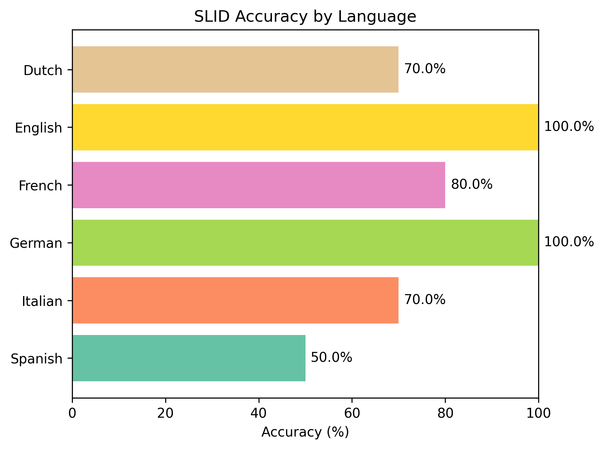

# SLID — Spoken Language Identification

SLID is a Python project that identifies the language spoken in an audio recording by combining speech recognition with simple natural language processing techniques. It compares candidate transcriptions using recognition confidence, character trigram coverage, and word frequency information.

## Supported languages

| Language | Code | Speech recognition locale |
| --- | --- | --- |
| English | `en` | `en-US` |
| Dutch | `nl` | `nl-NL` |
| French | `fr` | `fr-FR` |
| Italian | `it` | `it-IT` |
| Spanish | `es` | `es-ES` |
| German | `de` | `de-DE` |

## How it works

1. **Build reference profiles.** SLID uses translations of the Universal Declaration of Human Rights from NLTK's `udhr` corpus. It lowercases and tokenizes each text, joins the tokens with spaces, and builds character trigram profiles.
2. **Transcribe the audio for each language.** The same recording is sent to Google's speech recognition service through the `SpeechRecognition` library, once for each supported language. SLID uses the first returned transcription alternative.
3. **Evaluate each transcription.** Three signals contribute to its score:
   - **Recognition confidence:** the confidence value returned for the transcription, when available.
   - **Character trigram coverage:** the fraction of unique transcript trigrams found in that language's reference profile.
   - **Word frequency coverage:** the fraction of tokens whose `wordfreq` Zipf frequency is at least `2` in the candidate language.
4. **Combine the signals.** The weighted score is adjusted by the transcript's word count relative to the longest candidate transcription.
5. **Select a language.** The language with the highest final score is returned.

The scoring formula is:

```text
base_score = 0.40 × confidence
           + 0.35 × trigram_coverage
           + 0.25 × word_frequency_coverage

length_ratio = transcript_word_count / longest_transcript_word_count
final_score = base_score × (0.25 + 0.75 × length_ratio)
```

These are heuristic ranking scores, not calibrated probabilities. For example, a score of `0.8` does not mean an 80% probability of a correct prediction.

## Installation

Clone the repository and install its dependencies:

```bash
git clone https://github.com/TheCanineProgrammer/Spoken-Language-Identification.git
cd Spoken-Language-Identification
python -m pip install -r requirements.txt
```

Download the NLTK reference corpus once:

```bash
python -c "import nltk; nltk.download('udhr')"
```

The project uses `nltk`, `SpeechRecognition`, and `wordfreq`. Plotting the evaluation results also requires `matplotlib`.

An internet connection is required for Google speech recognition. Audio is sent to that external service for transcription.

## Usage

If the `SLID` class is saved in `slid.py`, use:

```python
from SLID import SLID

slid = SLID()

language = slid.predict("./voice/Dutch/Dutch_2.wav")
print("Predicted language:", language)

# Alternatively, return both the prediction and the language scores:
language, scores = slid.predict(
    "./voice/Dutch/Dutch_2.wav",
    return_scores=True,
)
print(language, scores)
```

Adjust the import to match the filename containing the class and replace the audio path with your own WAV recording.

## Evaluation

The initial evaluation uses **10 recordings per language**, for a total of **60 recordings**. For each language, accuracy is calculated as:

```text
Accuracy (%) = correctly identified recordings / tested WAV recordings × 100
```



With 10 recordings per language, each correct or incorrect prediction changes that language's accuracy by 10 percentage points. These results are an initial assessment on a small sample; a larger evaluation with varied speakers, accents, recording conditions, and clip lengths would give a more reliable estimate.

## Limitations

- Candidate transcriptions are generated under an assumed language. A plausible transcription does not guarantee that the original audio was spoken in that language.
- Recognition confidence may be missing, and values should not be assumed directly comparable across language requests. The current implementation uses zero when confidence is absent.
- UDHR provides a small, formal reference text that may not represent everyday speech well.
- The length adjustment favors longer transcriptions, which are not necessarily more accurate.
- The current selection always chooses among the supported languages. In the shared implementation, all-zero scores select the first language rather than producing an unknown result.
- Speech recognition requires multiple network requests per recording, which affects runtime and availability.

## Project scope and contributions

This is a simplified version of spoken language identification. **No AI models are trained in this project:** the language-selection logic uses natural language processing techniques and a weighted scoring rule. Audio transcription relies on Google's existing speech recognition models.

**All contributions are welcome!** Feel free to open an issue or submit a pull request with bug fixes, documentation improvements, additional language support, evaluation recordings you have permission to share, or ideas for improving the scoring approach.
